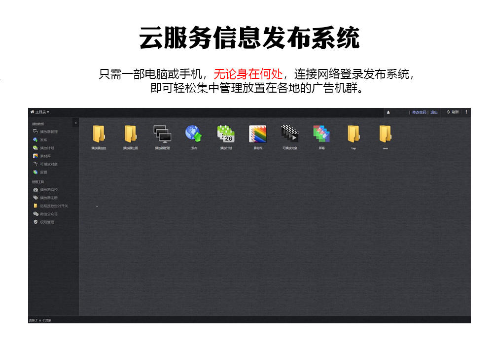

# xplay

专为树莓派(Raspberry Pi)与Windows系统设计的多媒体播放器 ...

---

支持(视频、音频、流媒体、图片、摄像头、动画、文本、滚动字幕、日期时间、二维码)


---

### [免费授权（免费、免费、免费、重要的事情说三遍）（点击获取）](https://gitee.com/nljb/xplay/issues/I14K0K)

---

[支持硬件](#支持硬件)  
[支持系统](#支持系统)  
[目录结构](#目录结构)  
[支持功能](#支持功能)  
[安装方法](#安装方法)  
[播放控制](#播放控制)  
[视频音频](#视频音频)  
[命令行工具](#命令行工具)  
[控制指令](#控制指令)  
[许可信息](#许可信息)  
[更多功能](#更多功能)  

---
### 支持硬件

| 硬件 | 分辨率 | FPS | 测试 |
| --- | --- | --- | --- |
| Raspberry Pi Zero  | 1080p/v720p  | 30 | 已测试 |
| Raspberry Pi 3A+   | 1080p/v720p  | 30 | 已测试 |
| Raspberry Pi 3B+   | 1080p/v720p  | 30 | 已测试 |
| Raspberry Pi 2B    | 1080p/v720p  | 30 | 未测试 |
| Raspberry Pi 3B    | 1080p/v720p  | 30 | 未测试 |
| Raspberry Pi 4B    | 1080p        | 30 | 已测试 |
| Windows 系统       | [github](https://github.com/nulijiabei/winxplay) / [gitee](https://gitee.com/nljb/winxplay) | 60 | 已测试 |

***理论上支持所有树莓派，但是经过测试的树莓派只有上面几款***

---
### 支持系统

| 系统版本 | 发布日期 | 安装程序 | 测试 |
| --- | --- | --- | --- |
| Raspbian Buster with desktop | 2019-09-26 | buster/ | 已测试 |
| Raspbian Buster Lite | 2019-09-26 | buster-lite/ | 已测试 |
| Raspbian Buster with desktop | 2020-02-13 | buster/ | 已测试 |
| Raspbian Buster Lite | 2020-02-13 | buster-lite/ | 已测试 |

---
### 目录结构

```
/usr/bin/xplay                  主程序
/usr/bin/xplayctl               命令行工具
/etc/xplay/log4qt.properties    日志配置文件
/etc/xplay/simsun.ttc           默认字体文件
/etc/ld.so.conf.d/00-xplay.conf 关联库文件指向
/usr/local/lib/...              关联库文件目录
```

---
### 支持功能

1. 支持自定义播放器分辨率、帧率(FPS)、音频采样率(Sample Rate)
2. 支持使用(TCP)连接播放器发送指令控制(播放、覆盖、停止、移动、等)
3. 支持(视频、音频、流媒体、图片、摄像头、动画、文本、滚动字幕、日期时间、二维码)素材播放
4. 支持(视频)多种格式(例如：MP4、AVI、MOV、等)基于H264的视频编码，音频(AAC)
5. 支持(图片)JPG与PNG格式
6. 支持(动画)GIF格式
7. 支持(视频)硬解播放
8. 支持(视频)预加载
9. 支持(摄像头)设备(Raspberry Pi Camera V2)
10. 支持(视频、图片)无黑场切换播放
11. 支持(视频、图片)序列播放
12. 支持(视频)音频同步(视频帧时间戳与音轨帧时间戳)播放
13. 支持(视频、流媒体、图片、摄像头、动画、文本、滚动字幕、日期时间、二维码)多层(Overlay)播放
14. 支持(文本)自定义(字体大小、字体颜色、背景颜色、透明度、对齐方式、风格样式、多行段落)
15. 支持(滚动字幕)自定义(字体大小、字体颜色、背景颜色、透明度、风格样式、移动速度、移动方向)
16. 支持(信息提示框)自定义提示文本及多种状态标识(notice、success、warning、error)
17. 支持(日期时间)自定义(字体大小、字体颜色、背景颜色、透明度、对齐方式、风格样式)
18. 支持(字体)自定义(可以通过自定义指定TTC字体来实现不同效果的文本样式)
19. 支持自定义布局(通过多层功能可以实现多种自定义布局)
20. 支持自定义(视频)是否循环播放(视频在播放到结尾时是否停留在最后一帧)
21. 支持自定义素材尺寸(width，height)，任意拉伸缩放素材尺寸播放
22. 支持自定义素材位置(x，y)播放，任意定义素材播放位置
23. 支持自定义素材横竖屏旋转(横屏角度：0、180，竖屏角度：90、270)
24. 支持自定义素材开始播放时间(多个播放器间可以实现同步播放)
25. 支持静音播放

---
### 安装方法

 ***1. 显存设置***
 
 | 文件 | 设置 | 说明 |
 | --- | --- | --- |
 | /boot/config.txt | gpu_mem=256 (显存内存分配不能少于192M) | 重启生效 |
 
 > 说明：经测试在720P视频轮播时显存不低于192M，1080P视频不低于256M，或更高 !!!
 
 ```
 // 该报错说明显存不足，请适当增加显存
 mmal: mmal_vc_port_enable: failed to enable port vc.ril.video_decode:out:0(I420): ENOMEM
 mmal: mmal_port_enable: failed to enable port vc.ril.video_decode:out:0(I420)(0xca5070) (ENOMEM)
 mmal: mmal_port_disable: port vc.ril.video_decode:out:0(I420)(0xca5070) is not enabled
 ```
 
 ***2. 安装程序***
 ```
 git clone https://github.com/nulijiabei/xplay.git 或 https://gitee.com/nljb/xplay.git
 cd xplay/
 cd buster/ 或者 cd buster-lite/ # Raspbian Buster with desktop 或者 Raspbian Buster Lite
 sh -x rpi_install.sh 或者 sh -x rpi4_install.sh # Raspberry Pi 023 或者 Raspberry Pi 4
 ```
 
 > 说明：Raspberry Pi 4 只支持 Raspbian Buster with desktop 下运行
 
 ***3. 运行程序***
 
 | 参数 | 默认 | 说明 |
 | --- | --- | --- |
 | -R x,y,width,height | 0,0,1920,1080 | 分辨率设置 |
 | -fps n | 30 | 帧率设置 |
 | -noloop | 无 | 视频在播放到结尾时是否停留在最后一帧 |
 | -mute | 无 | 静音设置 |
 | -sample_rate n | 44100 | 音频采样频率设置 |
 | -cpuid | 无 | 显示CPUID |
 | -version | 无 | 版本号 |
 
 ```
 // 分辨率 1920x1080 【默认】
 // 帧率 30fps 【默认】
 // 音频采样率 44100 【默认】
 // 视频循环播放【默认】
 // 播放声音【默认】
 /usr/bin/xplay
 
 // 分辨率设置 1280x720 
 // 音频采样率设置 48000 
 // 视频循环设置 视频在播放到结尾时停留在最后一帧
 // 【未设置则使用默认设置】
 /usr/bin/xplay -R 0,0,1280,720 -sample_rate 48000 -noloop
 ```
 
 ***4. 播放测试***
 ```
 // 测试素材
 cp xplay/video/sample.mp4 /root/sample.mp4
 // 测试指令
 /usr/bin/xplayctl -play -libName video -path "/root/sample.mp4"
 ```
 
 ***5. 查看日志***
 ```
 tail -n 100 /dev/shm/xplay.log
 ```

---
### 视频音频

 >推荐格式：VIDEO: MPEG-4(H.264/AVC)(YUV420P) 30FPS AUDIO: (AAC/MP4A) 44100Hz STEREO FLTP

 ```
 // 注意：需要统一视频素材的帧率与音频采样率并设置到启动参数中 ...
 /usr/bin/xplay -fps 30 -sample_rate 44100
 ```
 
---
### 播放控制

 * 通过Socket接口与播放器建立TCP连接，向播放器发送指令，从播放器接收返回
 * 可以通过多种支持Socket连接语言开发控制程序(java、python、C++、golang、等 ...)
 * 注：运行样例之前请先启动xplay主程序(/usr/bin/xplay &)
 
 [Golang 控制样例](example/example.go)  
 [Python 控制样例](example/example.py)  
 
---
### 命令行工具

 [xplayctl 命令行工具](example/xplayctl.go)  
 [example_x1_xplayctl.sh 基于命令行工具](example/example_x1_xplayctl.sh)  
 [example_x4_xplayctl.sh 基于命令行工具](example/example_x4_xplayctl.sh)  

 >请参考[控制指令](#控制指令)来使用以下命令行参数

 | 命令行参数(base) | 默认值 | 说明 |
 | --- | --- | --- |
 | -addr | 127.0.0.1:8700 | 网络地址及端口 |
 
 | 命令行参数(type) | 说明 |
 | --- | --- |
 | -play | 播放指令 |
 | -stop | 停止指令 |
 | -move | 移动指令 |
 | -snap | 截屏指令 |
 
 | 命令行参数(stop) | 说明 |
 | --- | --- |
 | -all  | 停止全部层 |
 | -ids  | 停止指定层 |
 
 | 命令行参数(move) | 默认值 | 可选参数 | 说明 |
 | --- | --- | --- | --- |
 | -zIndex | 10  | 0 - 999  | 层 |
 | -rect   | 0,0 | left,top |	素材显示位置 |
 
 | 命令行参数(snap) | 默认值 | 说明 |
 | --- | --- | --- |
 | -path | snap.jpg | 截屏保存路径 |
 
 | 命令行参数(play) | 默认值 | 可选参数 | 说明 |
 | --- | --- | --- | --- |
 | -start | -1 | 无 | 开始时间(ms) |
 | -libName | 无 | video、pic、sequence、gif、qrcode、camera、text、scroll、datetime、toast | 素材类型 |
 
 | 命令行参数(sequence) | 默认值 | 可选参数 | 说明 |
 | --- | --- | --- | --- |
 | -zIndex        | 10            | 0 - 999               | 层 |
 | -rect          | 0,0,1920,1080 | left,top,width,height |	素材显示尺寸与位置 |
 | -screen_mode   | landscape     | landscape、portrait   |	横竖屏模式 |
 | -screen_rotate | 0	            | 0、180、90、270       | 旋转角度 |
 | -path          | 无            | 素材路径1,素材路径2,素材路径3,... |	多个素材路径通过逗号(,)分隔 |
 | -duration      | 5	            | 无                    | 非视频素材所播放的时间(s) |

 | 命令行参数(video、pic、gif) | 默认值 | 可选参数 | 说明 |
 | --- | --- | --- | --- |
 | -zIndex        | 10            | 0 - 999               | 层 |
 | -rect          | 0,0,1920,1080 | left,top,width,height |	素材显示尺寸与位置 |
 | -screen_mode   | landscape     | landscape、portrait   |	横竖屏模式 |
 | -screen_rotate | 0	            | 0、180、90、270       | 旋转角度 |
 | -path          | 无            | 无                    |	素材路径 |

 | 命令行参数(qrcode) | 默认值 | 可选参数 | 说明 |
 | --- | --- | --- | --- |
 | -zIndex        | 10            | 0 - 999               | 层 |
 | -rect          | 0,0,1920,1080 | left,top,width,height |	素材显示尺寸与位置 |
 | -screen_mode   | landscape     | landscape、portrait   |	横竖屏模式 |
 | -screen_rotate | 0	            | 0、180、90、270       | 旋转角度 |
 | -content       | 无            | 无                    | 文本内容 |

 | 命令行参数(camera) | 默认值 | 可选参数 | 说明 |
 | --- | --- | --- | --- |
 | -zIndex        | 10            | 0 - 999               | 层 |
 | -rect          | 0,0,1920,1080 | left,top,width,height |	素材显示尺寸与位置 |
 | -screen_mode   | landscape     | landscape、portrait   |	横竖屏模式 |
 | -screen_rotate | 0	            | 0、180、90、270       | 旋转角度 |
 | -device        | /dev/video0   |	无                    | 设备地址 |
 | -camera_width  | 1280          | 无                    | 摄像头 video_size 宽 |
 | -camera_height | 720           | 无                    | 摄像头 video_size 高 |

 | 命令行参数(text) | 默认值 | 可选参数 | 说明 |
 | --- | --- | --- | --- |
 | -zIndex        | 10            | 0 - 999               | 层 |
 | -rect          | 0,0,1920,1080 | left,top,width,height |	素材显示尺寸与位置 |
 | -screen_mode   | landscape     | landscape、portrait   |	横竖屏模式 |
 | -screen_rotate | 0	            | 0、180、90、270       | 旋转角度 |
 | -content       | 无            | 无                    | 文本内容 |
 | -font_ttf      | 无            | 无                    | 指定字体 |
 | -font_size     | 18            | 12 - 72               | 字体大小 |
 | -color         | rgba(0,128,0,100%) | 无 | 文本颜色及透明度 |
 | -bgcolor       | rgba(0,0,0,20%)    | 无 | 背景颜色及透明度 |
 | -align         | center             | center、right、left | 对齐方式 |
 | -style         | normal             | normal、bold、italic、underline、strikethrough |	文本样式 |

 | 命令行参数(scroll) | 默认值 | 可选参数 | 说明 |
 | --- | --- | --- | --- |
 | -zIndex        | 10            | 0 - 999               | 层 |
 | -rect          | 0,0,1920,1080 | left,top,width,height |	素材显示尺寸与位置 |
 | -screen_mode   | landscape     | landscape、portrait   |	横竖屏模式 |
 | -screen_rotate | 0	            | 0、180、90、270       | 旋转角度 |
 | -content       | 无            | 无                    | 文本内容 |
 | -font_ttf      | 无            | 无                    | 指定字体 |
 | -font_size     | 18            | 12 - 72               | 字体大小 |
 | -color         | rgba(0,128,0,100%) | 无 | 文本颜色及透明度 |
 | -bgcolor       | rgba(0,0,0,20%)    | 无 | 背景颜色及透明度 |
 | -style         | normal             | normal、bold、italic、underline、strikethrough |	文本样式 |
 | -orientation   | horizontal         | horizontal、vertical	| 移动方向 |
 | -speed         | 1                  | 每帧向前移动像素 | 移动速度 |

 | 命令行参数(datetime) | 默认值 | 可选参数 | 说明 |
 | --- | --- | --- | --- |
 | -zIndex        | 10            | 0 - 999               | 层 |
 | -rect          | 0,0,1920,1080 | left,top,width,height |	素材显示尺寸与位置 |
 | -screen_mode   | landscape     | landscape、portrait   |	横竖屏模式 |
 | -screen_rotate | 0	            | 0、180、90、270       | 旋转角度 |
 | -font_ttf      | 无            | 无                    | 指定字体 |
 | -font_size     | 18            | 12 - 72               | 字体大小 |
 | -color         | rgba(0,128,0,100%) | 无 | 文本颜色及透明度 |
 | -bgcolor       | rgba(0,0,0,20%)    | 无 | 背景颜色及透明度 |
 | -align         | center             | center、right、left | 对齐方式 |
 | -style         | normal             | normal、bold、italic、underline、strikethrough |	文本样式 |

 | 命令行参数(toast) | 默认值 | 可选参数 | 说明 |
 | --- | --- | --- | --- |
 | -zIndex        | 10            | 0 - 999               | 层 |
 | -screen_mode   | landscape     | landscape、portrait   |	横竖屏模式 |
 | -screen_rotate | 0	            | 0、180、90、270       | 旋转角度 |
 | -content       | 无            | 无                    | 文本内容 |
 | -toast_type    | notice	       | notice、success、warning、error | 消息类型 |
 | -duration      | 0	            | 无                    | 持续时间(s) 超时关闭 永不超时(0) |

 ```
 /usr/bin/xplayctl -h # 帮助
 /usr/bin/xplayctl -stop -all # 停止全部层
 /usr/bin/xplayctl -stop -ids "10,11,12" # 停止指定层
 /usr/bin/xplayctl -snap -path "/dev/shm/snap.jpg" # 截屏
 /usr/bin/xplayctl -move -zIndex 10 -rect 100,100 # 移动位置
 /usr/bin/xplayctl -play -libName pic -path "/root/sample.jpg" # 显示图片
 /usr/bin/xplayctl -play -libName gif -path "/root/sample.gif" # 显示动画
 /usr/bin/xplayctl -play -libName video -path "/root/sample.mp4" # 显示视频
 /usr/bin/xplayctl -play -libName video -zIndex 10 -path "/root/sample.mp4" # 显示视频
 /usr/bin/xplayctl -play -libName qrcode -zIndex 5 -content "www.danoonetworks.com" # 显示二维码
 /usr/bin/xplayctl -play -libName datetime -zIndex 9 -rect "0,0,500,50" -font_size 30 -align center # 显示日期时间
 /usr/bin/xplayctl -play -libName toast -zIndex 3 -content "安装成功" -toast_type success -duration 5 # 显示信息提示框
 /usr/bin/xplayctl -play -libName text -zIndex 9 -rect "0,0,1920,50" -content "专为树莓派设计的多媒体播放器" # 显示文本
 /usr/bin/xplayctl -play -libName scroll -zIndex 9 -rect "0,0,-1,50" -content "专为树莓派设计的多媒体播放器" # 显示滚动字幕
 ```

 ```
 /usr/bin/xplayctl -play -libName scroll -zIndex 9 -rect "0,0,-1,50" \
                       -content "专为树莓派设计的多媒体播放器" \
                       -speed 2 \
                       -orientation horizontal 
 /usr/bin/xplayctl -play -libName scroll -zIndex 9 -rect "0,0,500,-1" \
                       -content "专为树莓派设计的多媒体播放器" \
                       -speed 2 \
                       -orientation vertical 
 /usr/bin/xplayctl -play -libName text -zIndex 9 -rect "0,0,1920,50" \
                       -content "专为树莓派设计的多媒体播放器" \
                       -color "rgba(0,128,0,100%)" \
                       -bgcolor "rgba(0,0,0,20%)" \
                       -font_size 14 \
                       -align center \
                       -style bold  
 /usr/bin/xplayctl -play -libName sequence -zIndex 10 -rect "0,0,1920,1080" \
                      -path "/root/a1.mp4,/root/b1.jpg,/root/a2.mp4" \
                      -duration 5
 ```

---
### 控制指令
  
 | 指令类型(type) | 说明 |
 | --- | --- | 
 | play | 播放 |
 | stop | 停止 |
 | move | 移动 |
 | snap | 截屏 |
 
 | 素材类型(libName) | 说明 |
 | --- | --- |
 | video | 视频/流媒体 |
 | toast | 信息提示框 |
 | camera | 摄像头 |
 | pic | 图片 |
 | gif | 动画 |
 | qrcode | 二维码 |
 | text | 文本 |
 | scroll | 滚动字幕 |
 | datetime | 日期时间 |
 | sequence | 序列播放 |
 
 ```
 // 指令说明
 {
     "id": "Z10_Play_1557737960000", // 唯一标记(自定义唯一标识)【非必填】
     "type": "play",                 // 指令类型【必填】
     "start": -1,                    // 开始时间(默认：-1，立即播放，本地毫秒时间戳)【非必填】
     "libName": "video",             // 素材类型(video、pic、sequence、camera、gif、qrcode、text、scroll ...）【必填】
     "params": {                     // 参数集合【必填】
         "zIndex": 10,               // 层(支持多层播放，层数越小画面越靠前)【必填】
         "path": "/root/sample.mp4", // 素材路径【必填】
         "left": 0,                  // 距左像素(X轴)【非必填】
         "top": 0,                   // 距顶像素(Y轴)【非必填】
         "width": 1920,              // 宽(素材显示的宽，非素材原始尺寸，支持缩放拉伸)【必填】
         "height": 1080,             // 高(素材显示的高，非素材原始尺寸，支持缩放拉伸)【必填】
         "screen_mode": "landscape", // 屏幕模式(横屏：landscape，竖屏：portrait，默认横屏)【非必填】
         "screen_rotate": 0          // 旋转角度(横屏角度：0、180，竖屏角度：90、270，默认横屏)【非必填】
     }
 }
 #End                                // 指令结束【必填】
 ```
 
 ```
  // 显示视频
  {
     "id": "Z10_Play_1557737960000",
     "type": "play",
     "start": -1,
     "libName": "video",
     "params": {
         "zIndex": 10,
         "path": "/root/sample.mp4",
         "left": 0,
         "top": 0,
         "width": 1920,
         "height": 1080,
         "screen_mode": "landscape",
         "screen_rotate": 0
     }
 }
 #End
 ```
 
 ```
 // 显示流媒体(http)
 {
    "id": "Z10_Play_1557737960000",
    "libName": "video",
    "start": -1,
    "type": "play",
    "params": {
        "path": "http://ivi.bupt.edu.cn/hls/cctv1hd.m3u8",
        "height": 1080,
        "width": 1920,
        "left": 0,
        "top": 0,
        "screen_mode": "landscape",
        "screen_rotate": 0,
        "zIndex": 10
     }
 }
 ```
 
 ```
 // 显示图片
 {
    "id": "Z10_Play_1556637960000",
    "type": "play",
    "start": -1,
    "libName": "pic",
    "params": {
        "zIndex": 10,
        "path": "/root/cat.jpg",
        "top": 0,
        "left": 0,
        "height": 1080,
        "width": 1920,
        "screen_mode": "landscape",
        "screen_rotate": 0
    }
 }
 #End
 ```
 
 | 序列播放(sequence) | 说明 |
 | --- | --- |
 | path | 多个素材路径通过逗号(,)分隔 |
 | duration | 非视频素材所播放的时间(s) |
 
 ```
 // 序列播放(格式一)
 {
    "type": "play",
    "id": "PLAY_Z10_1582276422",
    "libName": "sequence",
    "start": -1,
    "params": {
        "zIndex": 10,
        "path": "/root/a1.mp4,/root/b1.jpg,/root/a2.mp4,/root/b2.jpg",
        "duration": 10,
        "top": 0,
        "left": 0,
        "width": 1920,
        "height": 1080,
        "screen_mode": "landscape",
        "screen_rotate": 0
    }
 }
 #End
 ```
 
 | 序列播放(sequence) | 说明 |
 | --- | --- |
 | deps[] | 序列数据 |
 | deps[].path | 素材路径 |
 | deps[].type | 素材对应的 libName(video、pic) |
 | deps[].duration | 非视频素材所播放的时间(s) |
 
 ```
 // 序列播放(格式二)
 {
    "type": "play",
    "id": "PLAY_Z10_1582276422",
    "libName": "sequence",
    "start": -1,
    "params": {
        "zIndex": 10,
        "top": 0,
        "left": 0,
        "width": 1920,
        "height": 1080,
        "screen_mode": "landscape",
        "screen_rotate": 0
    },
    "deps": [{
        "duration": -1,
        "path": "/root/a1.mp4",
        "type": "video"
    }, {
        "duration": 10,
        "path": "/root/b1.jpg",
        "type": "pic"
    }, {
        "duration": -1,
        "path": "/root/a2.mp4",
        "type": "video"
    }, {
        "duration": 10,
        "path": "/root/b2.jpg",
        "type": "pic"
    }]
 }
 #End
 ```
 
 | 信息提示框(toast) | 值 | 说明 |
 | --- | --- | --- |
 | toast_type | notice、success、warning、error | 消息类型 |
 | duration | 0(永不超时) | 持续时间(s) 超时关闭 |
 
 ```
 // 显示信息提示框
 {
    "type": "play",
    "id": "Z3_Play_1572344489512",
    "libName": "toast",
    "start": -1,
    "params": {
       "zIndex": 3,
       "screen_rotate": 0,
       "screen_mode": "landscape",
       "content": "ABCDEFGHIJKLMNOPQRSTUVWXYZ",
       "toast_type": "notice",
       "duration": 5
    }
 }
 #End
 ```
 
 | 摄像头(camera) | 值 | 说明 |
 | --- | --- | --- |
 | device | /dev/video0 | 设备地址 |
 | camera_width | 1280 | 摄像头 video_size 宽 |
 | camera_height | 720 | 摄像头 video_size 高 |
  
 >启用摄像头 raspi-config > Interfacing Options > P1 Camera 

 ```
 // 显示摄像头
 {
    "id": "Z9_Play_1558837960000",
    "type": "play",
    "start": -1,
    "libName": "camera",
    "params": {
        "zIndex": 9,
        "device": "/dev/video0",
        "camera_width": 1280,
        "camera_height": 720,
        "top": 0,
        "left": 0,
        "width": 1920,
        "height": 1080,
        "screen_mode": "landscape",
        "screen_rotate": 0
    }
 }
 #End
 ```
 
 | 文本(text) | 值 | 说明 |
 | --- | --- | --- |
 | color     | rgba(0, 128, 0, 100%) | 文本颜色及透明度 |
 | bgcolor   | rgba(0, 0, 0, 0%)     | 背景颜色及透明度 |
 | font_ttf  | /etc/xplay/simsun.ttc | 指定字体 |
 | font_size | 14                    | 字体大小 |
 | align     | center、right、left   | 对齐方式 |
 | style     | normal、bold、italic、underline、strikethrough | 文本样式 |
 | content   | \t\t123,456,789\n987,654,321 | 文本内容 |
 
 | 内容(content) | 例 | 说明 |
 | --- | --- | --- |
 | \t        | \t\tABC               | 强制缩进 |
 | \n        | ABC\nBCD              | 强制换行 |
 | 空格      | ABCDEF ABCDEF ABCDEF  | 超过宽度时在空格处换行 | 
  
 ```
 // 显示文本
 {
    "type": "play",
    "id": "Z9_Play_1572344489512",
    "libName": "text",
    "start": -1,
    "params": {
       "top": 0,
       "left": 0,
       "width": 1280,
       "height": 50,
       "zIndex": 9,
       "screen_rotate": 0,
       "screen_mode": "landscape",
       "content": "ABCDEFGHIJKLMNOPQRSTUVWXYZ",
       "color": "rgba(255, 0, 0, 100%)",
       "bgcolor": "rgba(0, 0, 0, 0%)",
       "font_size": 30,
       "align": "center",
       "style": "bold"
    }
 }
 #End
 ```
 
 | 滚动字幕(scroll) | 值 | 说明 |
 | --- | --- | --- |
 | color       | rgba(0, 128, 0, 100%) | 文本颜色及透明度 |
 | bgcolor     | rgba(0, 0, 0, 0%)     | 背景颜色及透明度 |
 | font_ttf    | /etc/xplay/simsun.ttc | 指定字体 |
 | font_size   | 14 | 字体大小 |
 | style       | normal、bold、italic、underline、strikethrough | 文本样式 |
 | speed       | 1(每帧向前移动N像素) | 移动速度 |
 | content     | ABCDEFGHIJKLMNOPQRSTUVWXYZ | 文本内容 |  
 | orientation | horizontal、vertical | 移动方向 |
 
 | 参数有效性(scroll) | 值 | 说明 |
 | --- | --- | --- |
 | width  | vertical 有效 / horizontal 无效 = screen.width | 宽有效性 |
 | height | horizontal 有效 / vertical 无效 = screen.height | 高有效性 |
 | left   | vertical 有效 / horizontal 无效 = 0 | 距左有效性 |
 | top    | horizontal 有效 / vertical 无效 = 0 | 距顶有效性 |
 
 ```
 // 显示滚动字幕
 {
    "type": "play",
    "id": "Z9_Play_1572344489512",
    "libName": "scroll",
    "start": -1,
    "params": {
       "top": 0,
       "left": 0,
       "width": 150,
       "height": 50,
       "zIndex": 5,
       "screen_rotate": 0,
       "screen_mode": "landscape",
       "content": "ABCDEFGHIJKLMNOPQRSTUVWXYZ",
       "color": "rgba(255, 0, 0, 100%)",
       "bgcolor": "rgba(0,128,0,80%)",
       "font_size": 30,
       "style": "bold",
       "orientation": "horizontal",
       "speed": 1
    }
 }
 #End
 ```
 
 | 日期时间(datetime) | 值 | 说明 |
 | --- | --- | --- |
 | color     | rgba(0, 128, 0, 100%) | 文本颜色及透明度 |
 | bgcolor   | rgba(0, 0, 0, 0%)     | 背景颜色及透明度 |
 | font_ttf  | /etc/xplay/simsun.ttc | 指定字体 |
 | font_size | 30                    | 字体大小 |
 | align     | center、right、left   | 对齐方式 |
 | style     | normal、bold、italic、underline、strikethrough | 文本样式 |
 
 ```
 // 显示日期时间
 {
    "type": "play",
    "id": "Z9_Play_1572344489512",
    "libName": "datetime",
    "start": -1,
    "params": {
       "top": 0,
       "left": 0,
       "width": 500,
       "height": 50,
       "zIndex": 9,
       "screen_rotate": 0,
       "screen_mode": "landscape",
       "color": "rgba(0, 128, 0, 100%)",
       "bgcolor": "rgba(0, 0, 0, 20%)",
       "font_size": 30,
       "align": "center",
       "style": "bold"
    }
 }
 #End
 ```
 
 >如果动画显示不正常, 您可以使用Photoshop重新存储一下
 
 ```
 // 显示动画
 {
    "id": "Z9_Play_1554437960000",
    "type": "play",
    "start": -1,
    "libName": "gif",
    "params": {
        "zIndex": 9,
        "path": "/root/aaa.gif",
        "top": 0,
        "left": 0,
        "height": 100,
        "width": 100,
        "screen_mode": "landscape",
        "screen_rotate": 0
    }
 }
 #End
 ```
 
 ```
 // 显示二维码
 {
    "id": "Z9_Play_1558837960000",
    "type": "play",
    "start": -1,
    "libName": "qrcode",
    "params": {
        "zIndex": 9,
        "content": "http://www.danoonetwork.com",
        "top": 0,
        "left": 0,
        "height": 100,
        "width": 100,
        "screen_mode": "landscape",
        "screen_rotate": 0
    }
 }
 #End
 ```
 
 ```
 // 停止全部层
 {
   "type": "stop",
   "params": {
       "all": true
   }
 }
 #End
 ```
 
 ```
 // 停止指定层
 {
   "type": "stop",
   "params": {
       "ids": ["10", "11", "12"]
   }
 }
 #End
 ```
 
 ```
 // 移动位置
 {
   "type": "move",
   "params": {
     "zIndex": 10,
     "left": 100,
     "top": 100
   }
 }
 #End
 ```
  
 ```
 // 截屏
 {
   "type": "snap",
   "params": {
     "path": "/dev/shm/snap.jpg"
   }
 }
 #End
 ```
 
---
### 许可信息

>Qt 使用 LGPL 许可 https://www.qt.io/licensing/ 和 https://www.qt.io/features#js-6-3  
>通过LGPLv3许可证选项，您可以使用基本库和Qt的某些附加库。只要满足LGPLv3的所有要求，LGPLv3即可保持您的应用程序源代码关闭。  
>该程序所涉及 Qt Core 满足 LGPL 要求  

>LOG4QT 使用 APACHE LICENSE VERSION 2.0 https://www.apache.org/licenses/LICENSE-2.0.html  

>SDL 与 SDL_ttf 和 SDL_image(libjpeg、libpng、zlib1) 和 SDL_net 使用许可 https://www.zlib.net/zlib_license.html  
>授予任何人出于任何目的使用此软件的权限，包括商业应用，并对其进行更改和重新分发  

>jsoncpp 使用 MIT License  
>被授权人有权利使用、复制、修改、合并、出版发行、散布、再授权及贩售软件及软件的副本。  

>FFmpeg 使用 GNU较小通用公共许可证(LGPL) 许可 http://www.gnu.org/licenses/old-licenses/lgpl-2.1.html  
>FFmpeg License and Legal Considerations http://ffmpeg.org/legal.html  

>FFmpeg 在 Windows 系统许可 https://ffmpeg.zeranoe.com/builds/  
>FFmpeg is the leading multimedia framework to decode, encode, transcode, mux, demux, stream, filter and play. All builds require at least Windows 7 or Mac OS X 10.10. Nightly git builds are licensed as GPL 3.0, and release build are licensed as GPL 3.0 and LGPL 3.0. LGPL 3.0 release builds can be found using the "All Builds" links.  

---
### 更多功能

 * 基于云服务的信息发布系统(www.danoonetworks.com)
 * 提供一站式解决方案(软硬件、一体机、4G/WIFI网络、等 ...)



 ---

